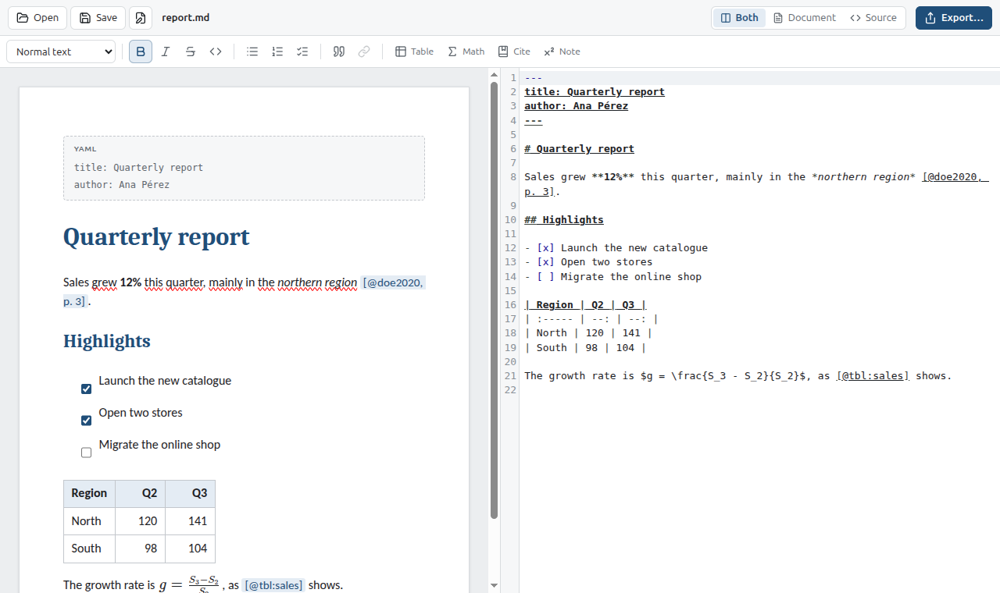
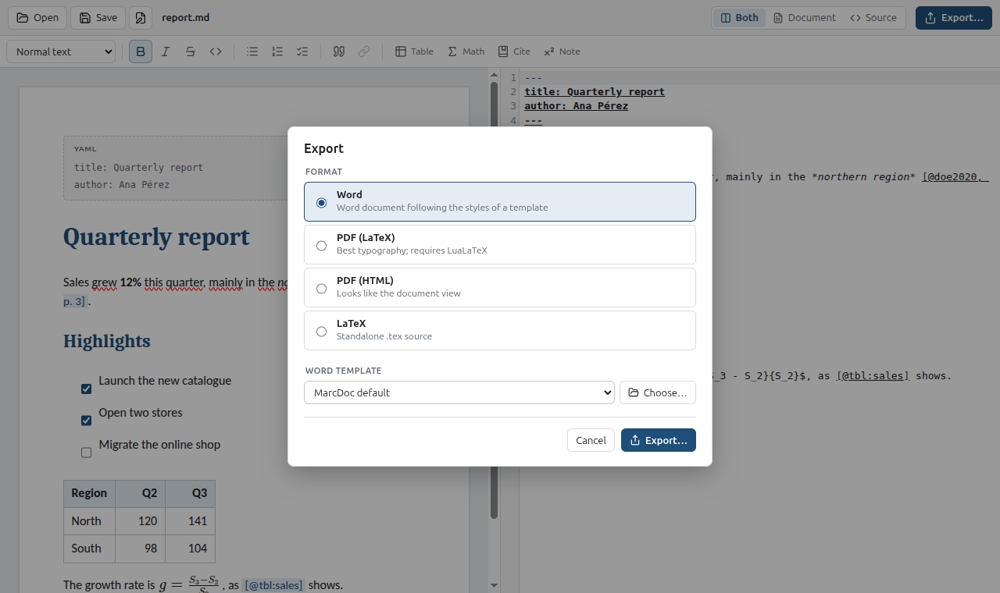

# MarcDoc

A Markdown editor for people who write documents, not code. Edit a `.md` file as you would in
a word processor, or as plain Markdown, side by side, and export it to Word following your own
template, to PDF or to LaTeX.



## Download

Get the latest version from the [Releases page](../../releases/latest):

| File                          | For                                            |
| ----------------------------- | ---------------------------------------------- |
| `MarcDoc-<version>.AppImage`  | Any recent Linux distribution, no installation |
| `marcdoc_<version>_amd64.deb` | Debian, Ubuntu and derivatives                 |
| `SHA256SUMS`                  | Checksums to verify the downloads              |

Windows and macOS builds are not published yet: they are configured but untested (see
[docs/adr/0005-platform-support.md](docs/adr/0005-platform-support.md)).

### Install

**AppImage**

```sh
chmod +x MarcDoc-*.AppImage
./MarcDoc-*.AppImage
```

It needs FUSE 2 (`sudo apt install libfuse2t64` on Ubuntu 24.04, `libfuse2` on older versions).

**.deb**

```sh
sudo apt install ./marcdoc_*_amd64.deb
```

This also installs Pandoc.

**Verify a download** (optional)

```sh
sha256sum --check --ignore-missing SHA256SUMS
```

### Requirements for export

Editing works on its own. Exporting uses tools installed on your system, which MarcDoc detects
and tells you about if they are missing:

- [Pandoc](https://pandoc.org/installing.html) 3.1 or later, for every export.
- For PDF via LaTeX: TeX Live with LuaLaTeX and the packages Pandoc's template uses:
  `sudo apt install texlive-luatex texlive-latex-extra`.

## Features

- **Two synchronized views.** A document view that looks like a page and a Markdown source view
  with syntax highlighting. Edits and scrolling follow each other. Show both, or one
  (`Ctrl+1`, `Ctrl+2`, `Ctrl+3`).
- **Your formatting is kept.** Editing in the document view rewrites only the paragraphs you
  change; the rest of the file stays exactly as you wrote it. Anything the document view does not
  understand, such as raw HTML, is preserved.
- **Rich Markdown.** GitHub Flavored Markdown (tables, task lists, strikethrough), math with
  `$…$`, footnotes, YAML front matter, citations `[@key, p. 3]` and numbered figures and tables
  with cross-references (`{#fig:id}`, `[@fig:id]`).
- **Images.** Paste or drop an image and it is copied into an `assets/` folder next to the
  document.
- **Word export with your template.** Choose a `.docx` or `.dotx` template and the document takes
  its styles, cover page, headers, footers and numbering. A visual editor maps each Markdown
  element (headings, quotes, tables, code…) to a style of the template. The output is normalized
  to the OOXML standard and validated with Microsoft's Open XML SDK; a review in Microsoft Word
  itself is still pending.
- **PDF and LaTeX.** PDF through LuaLaTeX, optionally with your own Pandoc LaTeX template (for
  example a university or journal one), or through HTML; or the `.tex` source.
- **Bibliography.** Citations are formatted with Pandoc's citeproc from the `bibliography`
  (BibTeX, CSL JSON…) and `csl` style named in the front matter.
- **English and Spanish** interface, light and dark themes.



## Quick start

1. **Open** a `.md` file, or start typing in the empty document.
2. Write in either view. In the document view, Markdown shortcuts work as you type: `# ` makes a
   heading, `- ` a list, `**bold**` bold text, `$x^2$` a formula.
3. **Save** with `Ctrl+S`.
4. **Export** with `Ctrl+E`: pick a format and, for Word, a template.

To cite, add the bibliography to the front matter and cite by key:

```markdown
---
title: My report
bibliography: references.bib
csl: apa.csl
lang: en-GB
---

As shown before [@doe2020, p. 3].
```

### Document view shortcuts

| Shortcut                                            | Action                                                 |
| --------------------------------------------------- | ------------------------------------------------------ |
| `Ctrl+B` / `Ctrl+I` / `` Ctrl+` `` / `Ctrl+Shift+X` | Bold / italic / inline code / strikethrough            |
| `Ctrl+Alt+1`…`6`, `Ctrl+Alt+0`                      | Heading 1–6, normal text                               |
| `Ctrl+Shift+8` / `Ctrl+Shift+7`                     | Bulleted / numbered list                               |
| `Tab` / `Shift+Tab`                                 | Indent / outdent list item; next / previous table cell |
| `Shift+Enter`                                       | Line break                                             |

## Documentation

- [docs/adr/](docs/adr/) — design decisions: editor, Word export pipeline, citations,
  cross-references, platform support.
- [docs/validation/word-online-checklist.md](docs/validation/word-online-checklist.md) — how
  Word output is reviewed.
- [CHANGELOG.md](CHANGELOG.md) — what changed in each version.
- [PLAN.md](PLAN.md) — the project plan and progress log (in Spanish).

## Development

Requires Node.js 22.12 or later. Exports in development need the same tools as above.

```sh
npm install
npm run dev
```

| Command                           | Description                                                                                                                                           |
| --------------------------------- | ----------------------------------------------------------------------------------------------------------------------------------------------------- |
| `npm run dev`                     | Start the app in development mode                                                                                                                     |
| `npm run build`                   | Type-check and build into `out/`                                                                                                                      |
| `npm test`                        | Unit tests                                                                                                                                            |
| `npm run test:e2e`                | End-to-end tests against the Electron app                                                                                                             |
| `npm run test:integration`        | Export the test corpus to Word with every template and validate it (needs Pandoc; Docker for the Open XML SDK; LibreOffice for the visual comparison) |
| `npm run package`                 | Build the AppImage and .deb into `dist/`                                                                                                              |
| `npm run test:packaged`           | Smoke test of the packaged app                                                                                                                        |
| `npm run validation:samples`      | Export review documents for the Word checklist                                                                                                        |
| `npm run lint` / `npm run format` | Lint / format the code                                                                                                                                |

### Releasing

Releases are built by GitHub Actions ([.github/workflows/release.yml](.github/workflows/release.yml)).
To publish version `x.y.z`:

1. Set `"version": "x.y.z"` in `package.json` and add a `## [x.y.z]` section to `CHANGELOG.md`.
2. Commit, then tag and push: `git tag vx.y.z && git push origin vx.y.z`.

The workflow checks the code, builds the AppImage and .deb, and creates the release with their
checksums and the changelog section as notes.

## License

[MIT](LICENSE)
